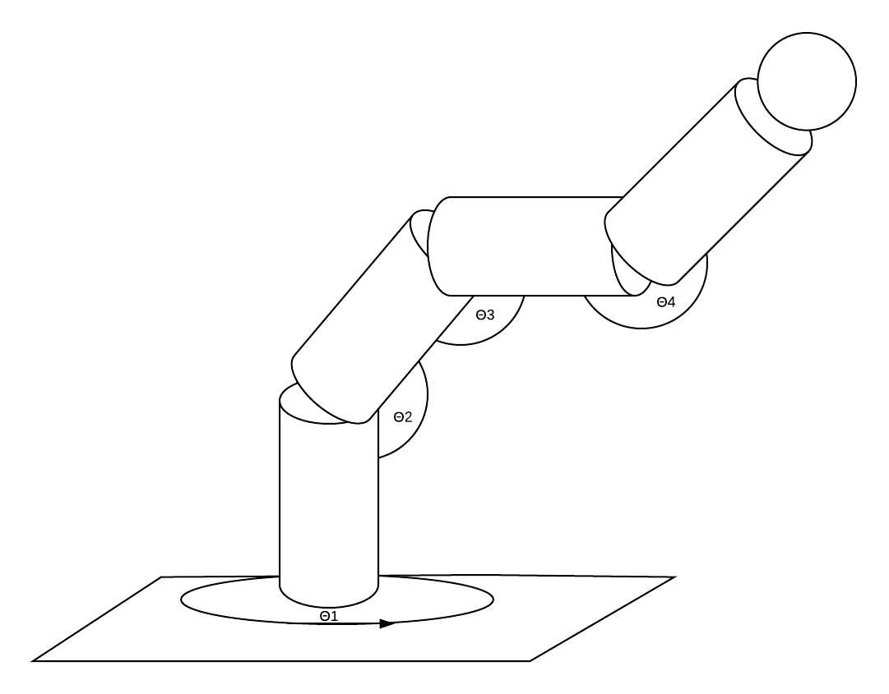
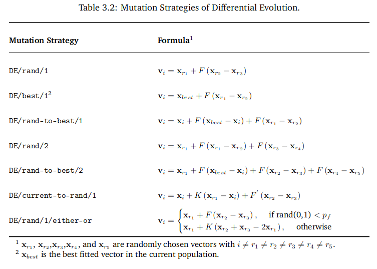

# Proyecto-EL4106
Proyecto-EL4106 Este consiste en la implementacion de algoritmos geneticos para el calculo de la cinematica inversa de un brazo robotico de 4dof.

# Links
[Repo brazo 4dof](https://github.com/JavierUR/SimpleArm)

# Meeting 1

## Brazo

## Algoritmo Evolutivo
### Definiciones
#### Codificación
Nuestra codificación para cada individuo sigue las normas de evolucion diferencial, en la cual no se consideran un genoma binario si no un genoma de valor Real, basados en el paper xxx es tomar los indivuos como:

Con cada uno de los angulos los angulos de rotación de cada uno de los motores del brazo. 

Esta solución es la más encontrada en la literatura sobre estos tipos.

Nosotros tambien proponemos la siguente codificacion:

Donde theta gorro es 

El cual es el vector de los N de la trayectoria discretizada.

#### Operador Genetico de selección

Para el operador genetico de selección se propone el one to one tournament el cual consite en evaluar el fitnes de los padres y los hijos individuo a individuo en el cual sobrevie el que obtenga un fitness mayor.

#### Croosover
Para el caso de los algoritmos de la funcion de crossover es complementaria a la mutación y esta dada por la siguiente formula:

Donde C_R es el croosover rate value el cual oscila entre 0 y 1.

Se tomo un criterio binario de croosover

#### Mutación
Se incluye la lista de posibles mutaciones

Donde F es el factor de escala y X_{r1} es el individuo de indice r_i con r_i un entero aleatorio.

#### Fitness
Nuestra funcion de fitnes dependeria del caso de nuestra codificación.
##### Caso 1

##### Caso 2

## Cinematica Directa
Para la cinematica directa se utilzo la formulacion 'Denavit-hartenberg' En la cual tenemos los valores parametrizados de:

Largo=0.5+0.1 mt

altura=0.1 mt

### Traslación de ejes

### Traslación de base

### Rotacion en eje y (brazos)

### Rotacion en eje z (base)

### Traslación final

